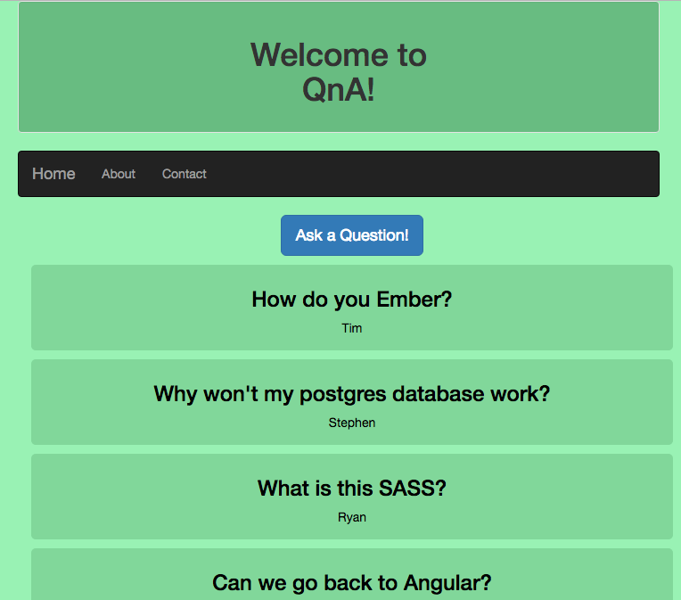

## Project Name
Question and Answer Site

## Features
This app will allow users to post questions. Then other users may answer the posted questions.

##Technologies
EmberJS, Firebase Database, CSS/SASS, NPM, Gulp, Bower

## Usage
To use the code, you can clone the repository at: [https://github.com/mehequanna/js-project3-ember](https://github.com/mehequanna/js-project3-ember).
* $ git clone https://github.com/mehequanna/js-project3-ember
* $ cd js-project3-ember

##NPM and Bower Dependency Installation
* In terminal and the project directory, run: $ npm install.
* Run: $ bower install
* Run: $ ember serve
* Go to: [http://localhost:4200](http://localhost:4200) in your browser.

##To Explore
I want to expand the app to have actual users, including an admin. The admin would be able to delete posts and comments.

## Author
Stephen Emery

##License
This work can be used under the MIT License.
Copyright (c) 2016 Stephen Emery
